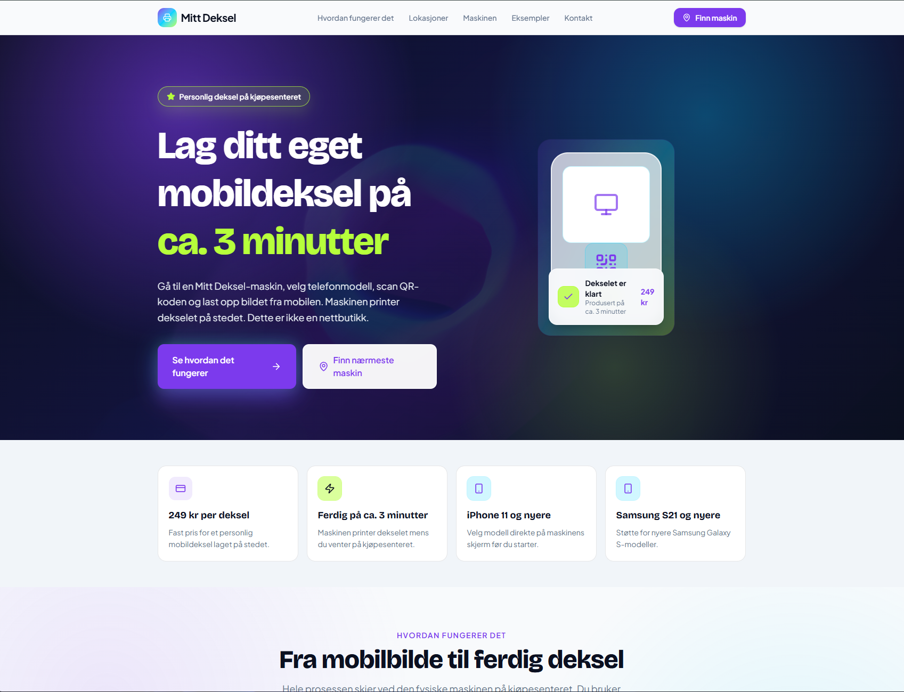
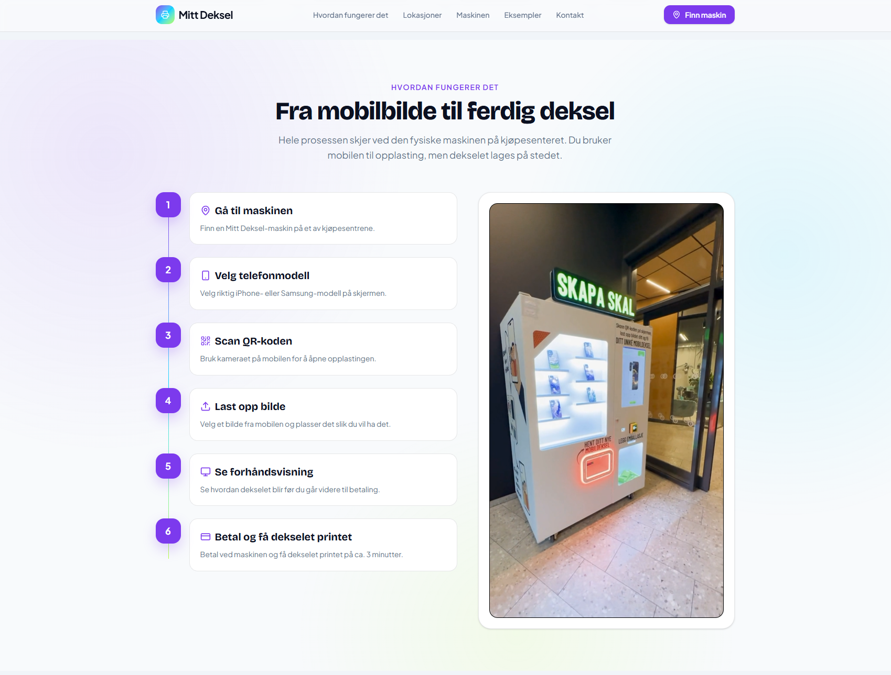
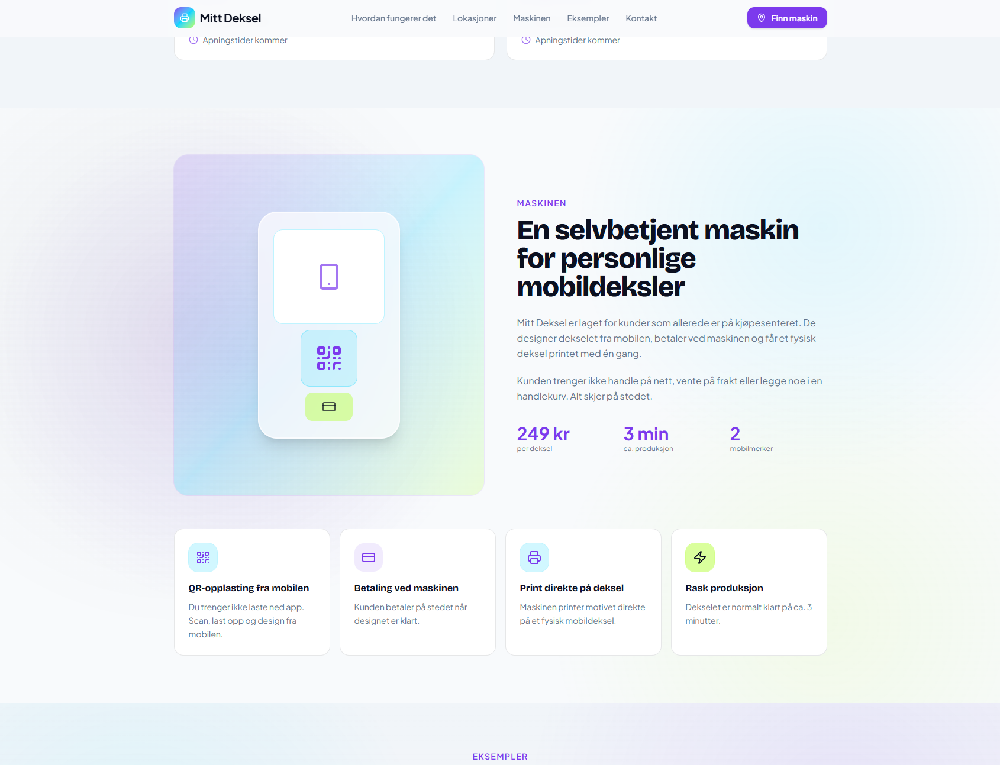

# Mitt Deksel

Mitt Deksel er en nettside jeg laget for et enkeltmannsforetak som tilbyr personlige mobildeksler.

Målet med siden var å lage en enkel og oversiktlig nettside som viser hva tjenesten går ut på, hvordan kunden bruker maskinen og hvor maskinene er tilgjengelige.

Kunden scanner en QR-kode, laster opp et bilde, ser en forhåndsvisning og går videre til betaling før dekselet blir printet.

## Bilder

### Forside



### Hvordan det fungerer



### Lokasjoner



## Hva nettsiden inneholder

- Forside med informasjon om tjenesten
- Forklaring av hvordan prosessen fungerer
- Video som viser løsningen
- Oversikt over støttede mobilmodeller
- Oversikt over lokasjoner
- Responsivt design for mobil og desktop
- Navigasjon mellom seksjonene på siden
- Animert bakgrunn på forsiden

## Teknologi

- React
- TypeScript
- Vite
- Tailwind CSS
- Vanta.js
- Three.js
- Lucide React

## Hva jeg jobbet med

Jeg bygde nettsiden opp med flere React-komponenter for å holde koden ryddig og gjøre det lettere å jobbe med de forskjellige delene av siden.

Jeg jobbet blant annet med:

- React-komponenter
- TypeScript
- responsivt design
- navigasjon
- videoavspilling når brukeren scroller til videoseksjonen
- Vanta.js og Three.js for animasjonen på forsiden
- egne datafiler for tekst, lokasjoner og annet innhold

Prosjektet ga meg mer praktisk erfaring med React og TypeScript, samtidig som jeg fikk jobbe med en nettside som skulle brukes til et faktisk firma.

## Starte prosjektet lokalt

Installer pakkene:

```bash
npm install
```

Start prosjektet:

```bash
npm run dev
```

Åpne deretter adressen som vises i terminalen, vanligvis:

```text
http://localhost:5173
```

## Status

Dette repoet inneholder frontend-delen av Mitt Deksel.

Selve kommunikasjonen med den fysiske maskinen og en komplett betalingsløsning er ikke implementert i denne versjonen.